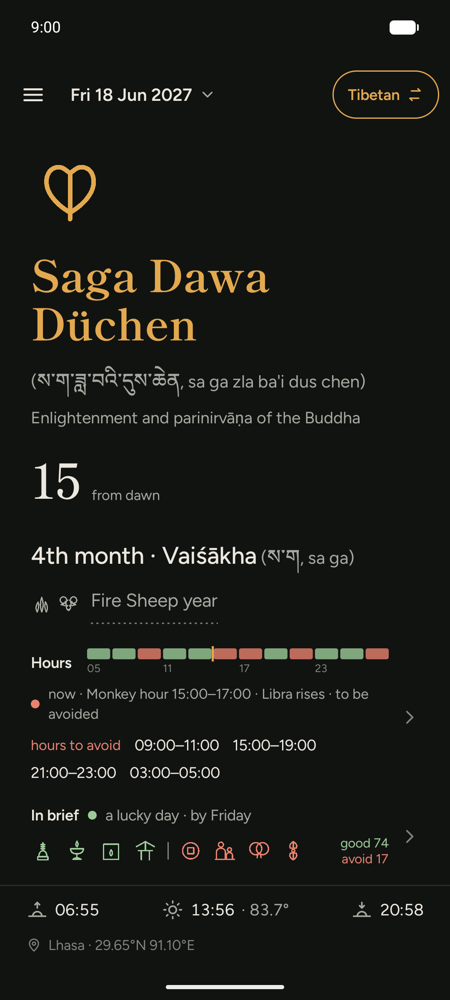
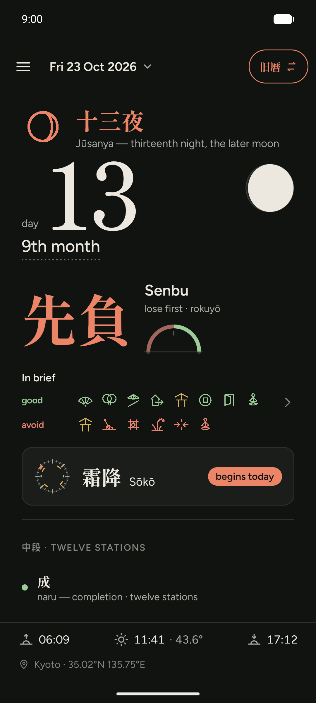
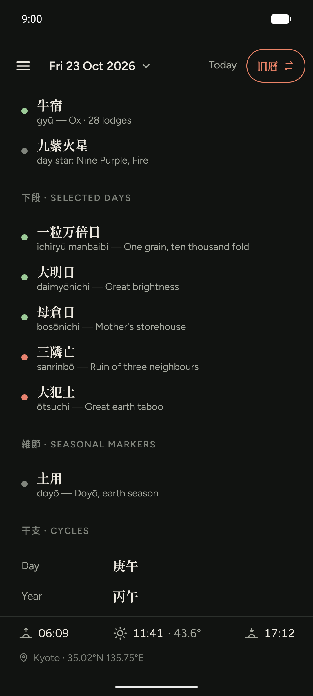
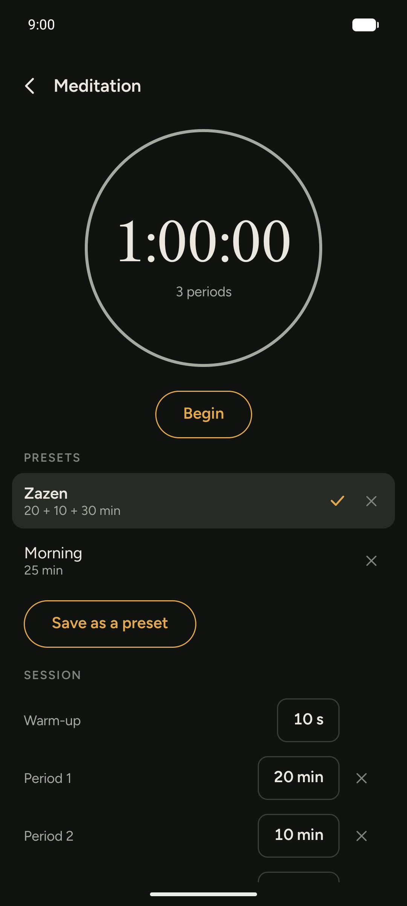

# Zanshin Calendar

An offline Android app that shows one day at a time in the Tibetan calendar
(Phugpa) or the old Japanese calendar (旧暦, Tenpō rules), with the almanac
readings of that day and sunrise, solar noon and sunset for your place.






- **Tibetan:** lunar day, month and year with skipped and doubled days and
  leap months; festivals and monthly observances; lunar mansion, yoga,
  karaṇa, element pair, lunar-day animal, trigram and number, each with its
  reading from the White Beryl and the *kun phan me long*; what changes
  within the day as the White Beryl's almanac writes it: a second mansion,
  a skipped yoga, Viṣṭi's span and the sun's terms, with their times; what
  its month heading writes: long or short, the planet that rises, the
  black months, the sage's and the pig's seven days and the comet; the
  hours with the combination period, the earth lords of the hour, the
  black hours, what each hour is good for, the four rough times at
  sunrise, noon, sunset and midnight, and the works an hour turns
  against the day's animal sign; the page in those texts' order of strength: the hours
  above the day, the day in brief with the works it allows and forbids
  and the one factor that decides, then the readings; hair-cutting days, personal days and
  mansions for a birth year; and for each person the year of age by the
  White Beryl's elemental divination: mewa, trigram and progressed sign,
  the pebbles with their predictions, growth and decline, and the year's
  obstacles.
- **旧暦:** month and day, 六曜, the current solar term, moon phase, 十二直,
  二十八宿, 九星, 選日 and 暦注下段 (with the lower band's own rules), 雑節,
  干支 and 恵方.
- **Meditation:** a timer of a warm-up and periods of any length, a wood
  block between periods (as a zazen of 20, 10 and 30 minutes), saved as
  presets, ringing with the screen off; and a mindfulness bell through the
  day, at fixed or random times within set hours. The bells are
  synthesised on the phone, so no sound file is bundled.
- Every Tibetan term and kanji shows its English on tap; every reading comes
  from a published source, listed in About & sources.
- Dates from 1900 to 2100. No internet permission: everything is computed on
  the phone.

## Install

[](https://f-droid.org/packages/io.github.iverlein.zanshin/)

Website: [zanshin.fyi](https://zanshin.fyi/)

## Build

JDK 21 and the Android SDK (platform 37) are needed.

```bash
./gradlew :core:test          # calendar engines
./gradlew :app:assembleDebug  # app/build/outputs/apk/debug/app-debug.apk
./gradlew :cli:run --args="2026-10-23"   # one day as text, on the desktop
```

The test vectors (published tables from Janson, Henning, NAOJ and
こよみのページ) are not in this repository; tests that need them are skipped.

The design, the formulas and their sources are in [docs/SPEC.md](docs/SPEC.md).

## Support

[Give me a tip](https://zanshin.fyi/donate/)

## Licence

Zanshin Calendar is free software under the [Mozilla Public License 2.0](LICENSE).

- Fonts: Figtree and Shippori Mincho, SIL Open Font License 1.1
  ([app/src/main/assets/licenses/](app/src/main/assets/licenses/)).
- City list: [GeoNames](https://www.geonames.org/), CC BY 4.0.
- Readings adapted from Japanese Wikipedia: CC BY-SA 4.0, credited in About &
  sources.
  All other readings are the project's own summaries of the cited sources.
